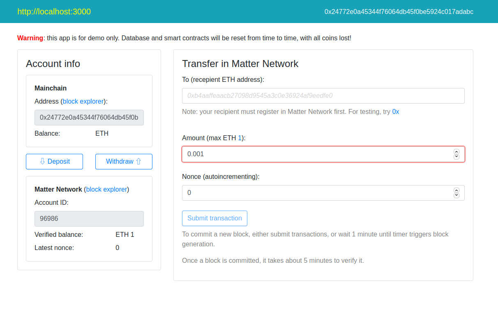
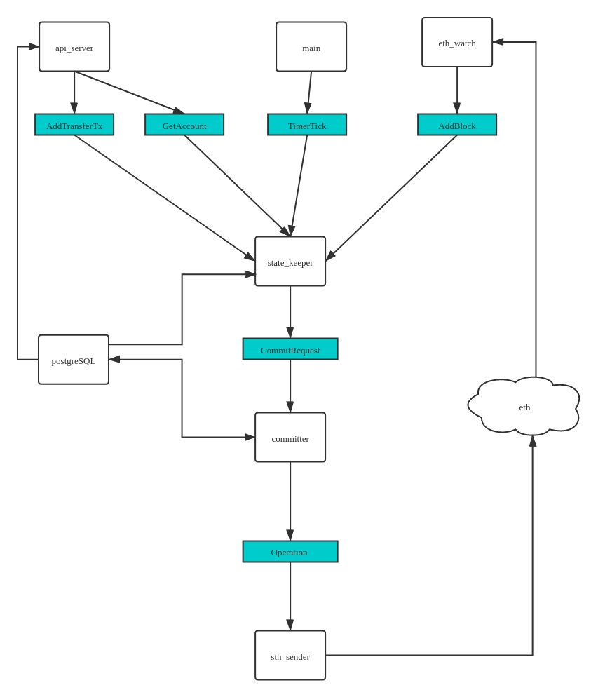

# myrollup DOC
## Client

## server
rollup server 总体架构
  
rollup的server分为6个部分  
1. main  
    程序的入口，负责启动api_server、eth_wathc、state_keeper、committer、eth_sender。同时开启一个定时器每100ms向state_keeper发送一个transfer出块请求，state_keeper在满足一定条件后将会出块。
2. api_server  
    处理web端的请求，接收交易请求，对交易的交易内容和签名进行验证，若通过检验则发送给state_keeper。处理web端的账户状态查询请求，返回当前账户已经提交的和通过验证的存款、转账、退出交易。
3. eth_watch
    监控eth上rollup负责存款和退出的智能合约，将获得的信息发送给state_keeper。
4. state_keeper
    维护rollup的账户状态树，启动时从数据库恢复状态树，处理存款、交易、退出请求。每个存款和退出请求都将出块，每60秒或8笔交易都将出块，当60秒但交易不足8笔时将进行填充。
5. committer  
    处理state_keeper的出块信息，将其中的账户更改提交到account_update表中，表示一提交但未生成证明的账户信息。读取数据库中已经生成的proof,并将已经生存proof的块内的数据更新到account表中。将账户更新信息和proof信息发送给eth_sender。
6. eth_sender  
    调用eth智能合约。  
*[detail](image/rollup_server_detail.png)*
---------------------------------------------------------------
myrollup server 总体架构
  
myrollup的server分为4部分（去除eth相关）  
1. main  
    程序入口,启动api_server,state_keeper,committer。...
2. api_server  
    处理web端的请求。去除eth相关代码后同时处理存款和退出请求。
3. state_keeper  
    ...
4. committer  
    ...  
*[detail](image/myrollup_server_detail.png)*

## prover
启动prover后循环查询数据库是否有已经出块但未被其他prover执行证明的block，且在查询期间将prover_runs上🔓，保证对一个block只有一个prover在生成proof。当从数据库中的获得的block number与本地的不一致时将自身的状态树更新至block number前一个已经生成证明的账户状态。生成的proof存储至数据库。
## 数据库
|表名|作用|
|:----|:----|
|accounts_updates|存储以及提交并更改的账户状态|
|accounts|存储已经生成证明的账户状态|
|active_provers|存储生成证明的prover名,启动时间和停止时间|
|op_coffig|未用|
|operations|存储提交和验证操作的数据，时间|
|proofs|存储每个生成的block的证明|
|prover_runs|记录每个block的证明的生成者|
|server_config|存储智能合约地址|
|transactions|存储每个存款、交易、退出的信息，包括类型、from、to、数额、状态树根hash、时间等|
